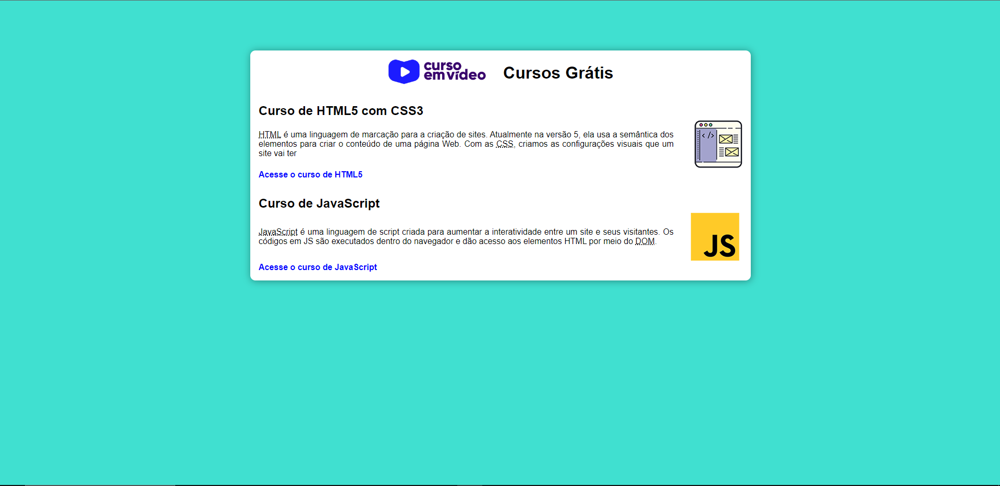

# projetoSite
<h1 align="center">Site de apresentação</h1>

 Site produzido a partir do curso de Git e GitHub do Curso em Video.  

  <a href="#-tecnologias">Tecnologias</a>&nbsp;&nbsp;&nbsp;|&nbsp;&nbsp;&nbsp;
  <a href="#-projeto">Projeto</a>&nbsp;&nbsp;&nbsp;|&nbsp;&nbsp;&nbsp;
  <a href="#memo-licença">Licença</a>

  

 

  

## 🚀 Tecnologias

Esse projeto foi desenvolvido com as seguintes tecnologias:

- HTML e CSS
- Github
- Figma

## 💻 Projeto

Site com cards feitos para apresentação do projeto do Curso em Video. 

- [Visite o projeto online](https://helenapl145.github.io/projetoSite/)
## :memo: Licença

Esse projeto está sob a licença MIT.

---

Feito com ♥ by Helena Lima

